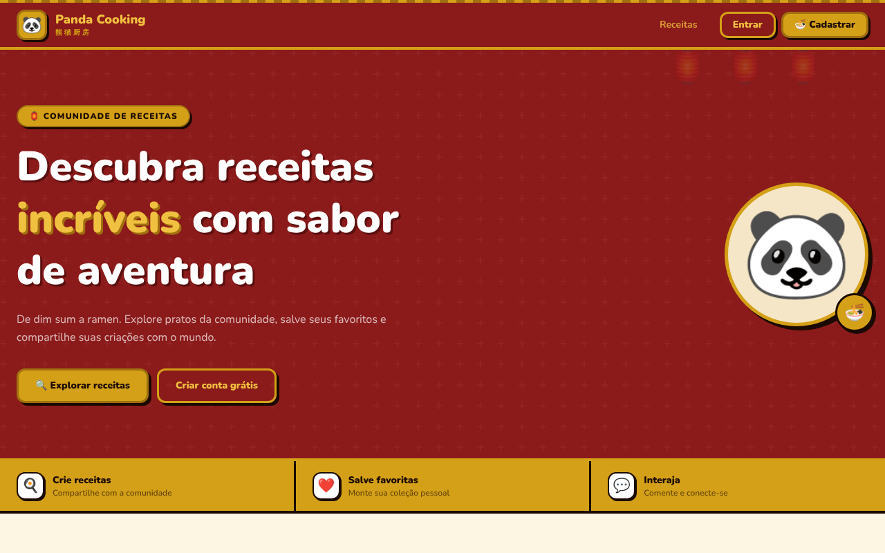
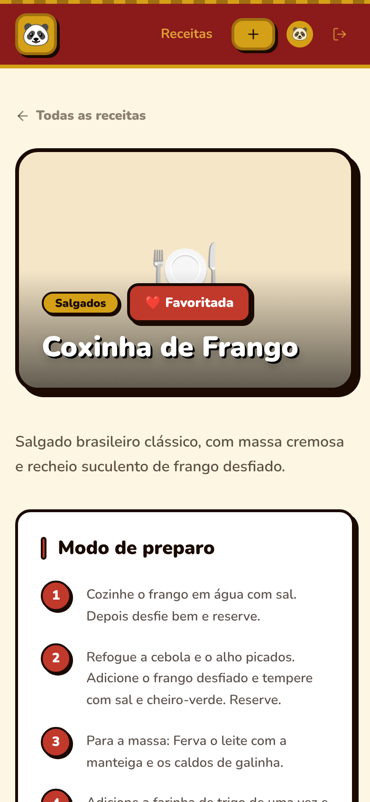
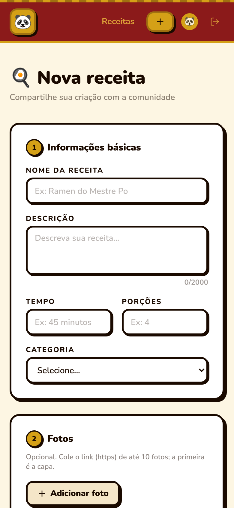
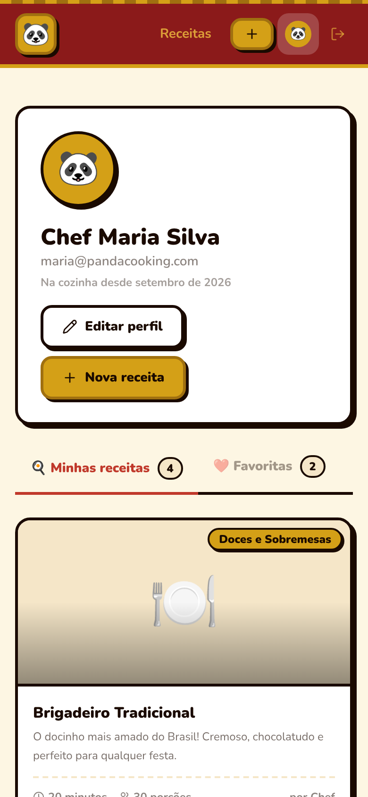
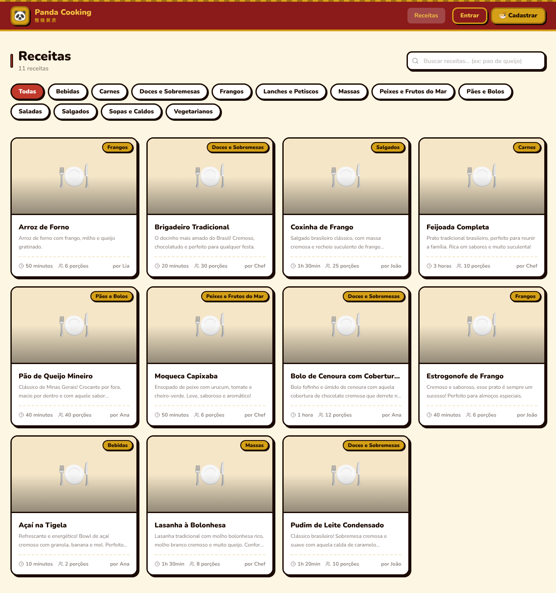
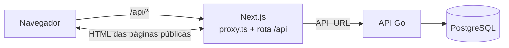

# Panda Cooking — Front

[](https://github.com/Victor-Novakoski/panda-cooking-front/actions/workflows/ci.yml)

Rede de receitas. Qualquer pessoa navega, busca e lê as receitas; com conta, publica as suas com fotos, ingredientes e modo de preparo, comenta e guarda as favoritas.

Este é o front, em Next.js. A API, em Go, está em [panda-cooking-go-api](https://github.com/Victor-Novakoski/panda-cooking-go-api). Roda inteiro na máquina com `docker compose up`; o deploy é a próxima etapa.



| Receita | Nova receita | Perfil |
| --- | --- | --- |
|  |  |  |

> As fotos das receitas de demonstração vêm do Unsplash. Nos prints acima elas aparecem como o ícone de prato, que é o que o front mostra quando a imagem não carrega.

## O que dá para fazer

**Sem conta**
- Ver as receitas mais novas na página inicial e abrir qualquer uma, com fotos, ingredientes, modo de preparo e comentários.
- Buscar sem se preocupar com acento ("pao" acha "Pão de Queijo Mineiro"), filtrar por categoria e navegar pelas páginas. Busca, categoria e página ficam na URL: dá para compartilhar o link, e voltar da receita traz a lista como estava.

**Com conta**
- Publicar receita com até 10 fotos (por link), 50 ingredientes com quantidade e 50 passos de preparo, editar e apagar as suas.
- Comentar, editar e apagar o próprio comentário.
- Favoritar e ver no perfil as próprias receitas e as favoritas, em duas abas.
- Editar o perfil e apagar a conta.



## Destaques técnicos

- **Sessão sem token no navegador.** O access token (15 min) fica só em memória e o refresh token num cookie `HttpOnly`, `SameSite=Strict`, que o JavaScript não lê. Ao recarregar, a sessão volta pelo cookie; com o token vencido, o front renova uma vez e repete a requisição, mesmo com várias saindo ao mesmo tempo.
- **Mesma origem para a API.** O navegador só fala com o próprio front: uma rota do Next repassa `/api/*` para a API, conferindo a origem (CSRF), limitando o corpo a 1 MiB e desistindo em 15 s. Sem CORS, e a URL da API nunca vai para o navegador.
- **CSP com nonce** gerada a cada requisição no `proxy.ts`, junto com os outros headers de segurança; rota com login é redirecionada ainda no servidor.
- **Formulários com os mesmos limites da API** (React Hook Form + Zod). Os erros 422 da API aparecem no campo certo, inclusive dentro de listas (`ingredients[2].amount`).
- **Login e logout acompanhados entre abas** por `BroadcastChannel`, com o cache do usuário descartado na troca de conta.
- **Páginas públicas renderizadas no servidor**, com título e prévia para link compartilhado, e 404 de verdade para receita que não existe.
- **API fora do ar não desloga ninguém:** a sessão fica como indisponível e a página avisa, em vez de mandar para o login.
- **178 testes** com Vitest e Testing Library, escritos pelo que o usuário vê. A CI roda lint sem warning, tipos, build, `npm audit` e gitleaks em todo PR.

## Como funciona



O navegador nunca vê o endereço da API: tudo passa pelo servidor do Next, que repassa para a API pela rede interna.

| Página | Rota | Login |
| --- | --- | --- |
| Início, com as receitas mais novas | `/` | — |
| Receitas: busca, categoria e paginação | `/dashboard` | — |
| Receita: fotos, ingredientes, preparo, comentários | `/recipes/[id]` | para comentar e favoritar |
| Nova receita, editar e apagar a sua | `/recipes/new`, `/recipes/[id]/edit` | ✅ |
| Perfil: minhas receitas e favoritas | `/profile` | ✅ |
| Editar perfil e apagar conta | `/profile/edit` | ✅ |

Os detalhes estão em [ARCHITECTURE.md](docs/ARCHITECTURE.md) e [SECURITY.md](docs/SECURITY.md).

## Stack

- **Front:** Next.js 16 (App Router), React 19, TypeScript e Tailwind CSS 4
- **Dados:** TanStack Query (cache, paginação e atualização otimista) e axios com renovação de token no 401
- **Sessão e formulários:** Zustand (só em memória), React Hook Form e Zod
- **Testes:** Vitest e Testing Library (jsdom)
- **CI:** GitHub Actions (ESLint, TypeScript, build, Vitest, npm audit, gitleaks e título do PR em Conventional Commits)

## Como rodar

O jeito mais simples sobe front, API e banco juntos, e precisa só de Docker. Clone os dois repositórios lado a lado:

```bash
git clone https://github.com/Victor-Novakoski/panda-cooking-go-api.git
git clone https://github.com/Victor-Novakoski/panda-cooking-front.git
cd panda-cooking-go-api
cp .env.example .env
docker compose up --build
```

| O quê | Onde |
| --- | --- |
| Site | http://localhost:3000 |
| API | http://localhost:8080/health |
| OpenAPI | http://localhost:8080/api/openapi.yaml |

Na primeira subida a API cria dez receitas e três usuários de demonstração. Todos entram com a senha `panda-cooking-demo`:

| Usuário | E-mail |
| --- | --- |
| Chef Maria Silva | `maria@pandacooking.com` |
| João Cozinheiro | `joao@pandacooking.com` |
| Ana Paula Gourmet | `ana@pandacooking.com` |

Salvar um arquivo recarrega o site sozinho.

<details>
<summary>Rodar o front fora do Docker</summary>

Precisa de Node 22 (tem um `.nvmrc`) e da API rodando em `http://localhost:8080` (`docker compose up api` no repositório da API sobe banco e API, sem o front):

```bash
cp .env.example .env.local   # API_URL=http://localhost:8080
npm install
npm run dev                  # http://localhost:3000
```

| Comando | O que faz |
| --- | --- |
| `npm run dev` | servidor de desenvolvimento |
| `npm run lint` | ESLint, sem aceitar warning |
| `npm run typecheck` | TypeScript |
| `npm test` | testes (Vitest e Testing Library); `npm run test:watch` roda enquanto edita |
| `npm run build` e `npm start` | build e servidor de produção |

</details>

## Roteiro de 5 minutos

1. Abra http://localhost:3000 e clique em "Explorar receitas".
2. Busque por `pao` (sem acento mesmo) e repare que acha "Pão de Queijo Mineiro". Filtre por "Doces e Sobremesas" e copie a URL: ela carrega a lista exatamente assim.
3. Abra uma receita e clique em "Entrar": depois do login você volta para ela.
4. Entre como `maria@pandacooking.com` com a senha `panda-cooking-demo`, favorite a receita e deixe um comentário.
5. Em "Nova receita", envie o formulário vazio para ver a validação, e depois preencha e publique uma receita sua. Para as fotos, cole um link `https` de imagem.
6. No perfil, veja a receita nova em "Minhas receitas" e a favoritada em "Favoritas".
7. Recarregue a página: você continua logado, mesmo sem nenhum token guardado no navegador.

## Testes

```bash
npm test                          # 178 testes (Vitest e Testing Library)
npm run lint && npm run typecheck
npm run build
```

A CI roda tudo isso em todo PR, mais `npm audit` do que vai para produção, gitleaks no histórico e o título do PR em Conventional Commits.

## Estrutura

```
src/app            páginas, uma pasta por rota; api/[...path] repassa /api para a API
src/components     ui/ (Input, Textarea, Pagination, Notice), layout/ (Header, AuthLayout),
                   recipe/ (cartão, formulário, comentários, favoritar, imagem), user/ (Avatar)
src/hooks          hooks do TanStack Query (useRecipes, useFavorites) e useRequireAuth
src/lib            sessão, repasse /api (bff.ts), busca no servidor (server-api.ts),
                   limites dos formulários (limits.ts) e erros da API no campo certo (forms.ts)
src/services       uma função por chamada da API, agrupadas por recurso
src/store          auth.store.ts: usuário, access token e situação da sessão
src/types          tipos que espelham as respostas da API
src/proxy.ts       CSP com nonce, headers de segurança e rotas com login
docs/telas         os prints deste README (tirar-prints.mjs gera todos de novo)
```

O teste fica ao lado do arquivo testado (`api.ts` → `api.test.ts`, `page.tsx` → `page.test.tsx`).

## Decisões

- **Repasse `/api` pelo próprio front** em vez de o navegador chamar a API direto: a sessão vira cookie de mesma origem, sem CORS, e o endereço da API fica no servidor.
- **Access token só em memória:** `localStorage` é lido por qualquer script injetado; recarregar a página custa uma renovação pelo cookie, e isso é barato.
- **Busca e filtros na URL**, não em estado interno: o link é compartilhável e o botão voltar funciona.
- **Limites dos formulários copiados da API** (`src/lib/limits.ts`): o aviso chega antes do envio, mas quem decide continua sendo a API.
- **Página pública renderizada no servidor** e página de quem está logado buscada no navegador: a primeira precisa de prévia em link compartilhado, a segunda depende da sessão.

O registro completo está em [MEMORY.md](docs/MEMORY.md).

## Documentação

| Documento | Conteúdo |
| --- | --- |
| [PRD](docs/PRD.md) | O que o produto faz, tela por tela |
| [Arquitetura](docs/ARCHITECTURE.md) | Renderização, sessão, pastas e repasse `/api` |
| [Segurança](docs/SECURITY.md) | Cada risco, a CSP e o que fica para o deploy |
| [Design](docs/DESIGN.md) | Convenções das interfaces |
| [Regras](docs/RULES.md) | Código, segurança, testes e fluxo de git |
| [Tarefas](docs/TASKS.md) e [Memória](docs/MEMORY.md) | O que foi feito e o porquê de cada decisão |

## Próximos passos

O deploy: front e API em containers atrás de HTTPS (os cookies `Secure` dependem disso), com `API_URL` em tempo de execução. O que falta está em [TASKS.md](docs/TASKS.md).

Feito por [Victor Novakoski](https://github.com/Victor-Novakoski).
